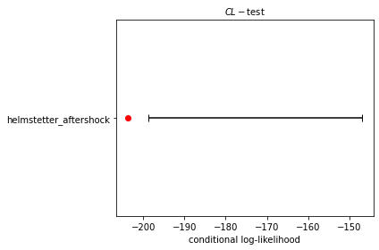
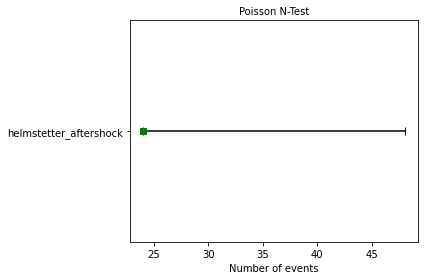
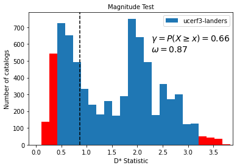
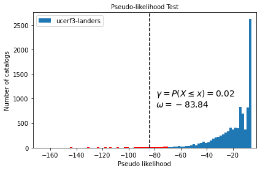
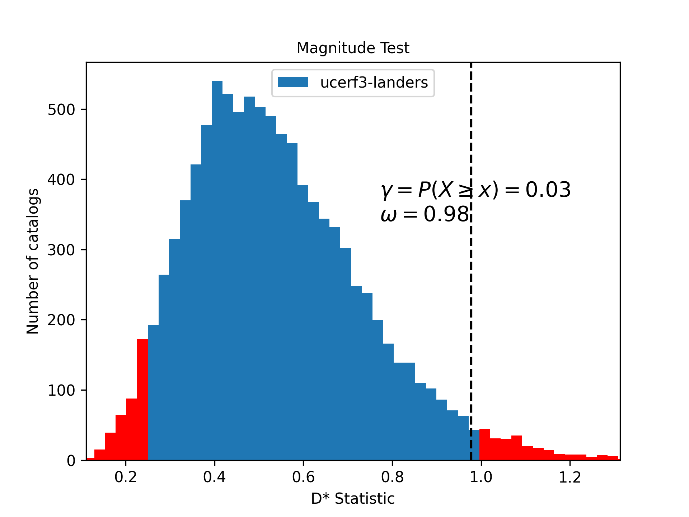

Theory of CSEP Tests
====================

This page describes the theory of each of the forecast tests
included in pyCSEP along with working code examples. You will find
information on the goals of each test, the theory behind the tests, how
the tests are applied in practice, and how forecasts are ‘scored’ given
the test results. Also, we include the code required to run in each test
and a description of how to interpret the test results.

.. code:: ipython3

    import csep
    from csep.core import (
        regions,
        catalog_evaluations,
        poisson_evaluations as poisson
    )
    from csep.utils import (
        datasets,
        time_utils,
        comcat,
        plots,
        readers
    )

    # Filters matplotlib warnings
    import warnings
    warnings.filterwarnings('ignore')

Grid-based Forecast Tests
-------------------------

These tests are designed for grid-based forecasts (e.g., Schorlemmer et
al., 2007), where expected rates are provided in discrete Poisson
space-magnitude cells covering the region of interest. The region
:math:`\boldsymbol{R}` is then the product of the spatial rate
:math:`\boldsymbol{S}` and the binned magnitude rate
:math:`\boldsymbol{M}`,

.. math::  \boldsymbol{R} = \boldsymbol{M} \times \boldsymbol{S}.

A forecast :math:`\boldsymbol{\Lambda}` can be fully specified as the
expected number of events (or rate) in each space-magnitude bin
(:math:`m_i, s_j`) covering the region :math:`\boldsymbol{R}` and
therefore can be written as

.. math::  \boldsymbol{\Lambda} = \{ \lambda_{m_i, s_j}| m_i \in \boldsymbol{M}, s_j \in \boldsymbol{S} \},

where :math:`\lambda_{m_i, s_j}` is the expected rate of events in
magnitude bin :math:`m_i` and spatial bin :math:`s_j`. The observed
catalogue of events :math:`\boldsymbol{\Omega}` we use to evaluate the
forecast is similarly discretised into the same space-magnitude bins,
and can be described as

.. math::  \boldsymbol{\Omega} = \{ \omega_{m_i, s_j}| m_i \in \boldsymbol{M}, s_j \in \boldsymbol{S} \},

where :math:`\omega_{m_i, s_j}` is the observed number of
events in spatial cell :math:`s_j` and magnitude bin :math:`m_i`. The
magnitude bins are specified in the forecast: typically these are in 0.1
increments and this is the case in the examples we use here. These
examples use the Helmstetter et al (2007) smoothed seismicity forecast
(including aftershocks), testing over a 5 year period between 2010 and
2015.

.. code:: ipython3

    # Set up experiment parameters
    start_date = time_utils.strptime_to_utc_datetime('2010-01-01 00:00:00.0')
    end_date = time_utils.strptime_to_utc_datetime('2015-01-01 00:00:00.0')

    # Loads from the PyCSEP package
    helmstetter = csep.load_gridded_forecast(
        datasets.helmstetter_aftershock_fname,
        start_date=start_date,
        end_date=end_date,
        name='helmstetter_aftershock'
    )

    # Set up evaluation catalog
    catalog = csep.query_comcat(helmstetter.start_time, helmstetter.end_time,
                                min_magnitude=helmstetter.min_magnitude)

    # Filter evaluation catalog
    catalog = catalog.filter_spatial(helmstetter.region)

    # Add seed for reproducibility in simulations
    seed = 123456

    # Number of simulations for Poisson consistency tests
    nsim = 100000

.. parsed-literal::

    Fetched ComCat catalog in 5.9399449825286865 seconds.

    Downloaded catalog from ComCat with following parameters
    Start Date: 2010-01-10 00:27:39.320000+00:00
    End Date: 2014-08-24 10:20:44.070000+00:00
    Min Latitude: 31.9788333 and Max Latitude: 41.1431667
    Min Longitude: -125.3308333 and Max Longitude: -115.0481667
    Min Magnitude: 4.96
    Found 24 events in the ComCat catalog.

Consistency tests
~~~~~~~~~~~~~~~~~

The consistency tests evaluate the consistency of a forecast against
observed earthquakes. These tests were developed across a range of
experiments and publications (Schorlemmer et al, 2007; Zechar et al
2010; Werner et al, 2011a). The consistency tests are based on the
likelihood of observing the catalogue (actual recorded events) given the
forecast. Since the space-magnitude bins are assumed to be independent,
the joint-likelihood of observing the events in each individual bin
given the specified forecast can be written as

.. math::  Pr(\omega_1 | \lambda_1) Pr(\omega_2 | \lambda_2)...Pr(\omega_n | \lambda_n) = \prod_{m_i , s_j \in \boldsymbol{R}} f_{m_i, s_j}(\omega(m_i, s_j)),

where :math:`f_{m_i, s_j}` specifies the probability distribution in
each space-magnitude bin. We prefer to use the joint log-likelihood in
order to sum log-likelihoods rather than multiply the likelihoods. The
joint log-likelihood can be written as:

.. math::  L(\boldsymbol{\Omega} | \boldsymbol{\Lambda}) = \sum_{m_i , s_j \in \boldsymbol{R}} log(f_{m_i, s_j}(\omega(m_i, s_j)).

The likelihood of the observations, :math:`\boldsymbol{\Omega}`, given
the forecast :math:`\boldsymbol{\Lambda}` is the sum over all
space-magnitude bins of the log probabilities in individual cells of the
forecast. Grid-based forecasts are specified by the expected number of
events in a discrete space-magnitude bin. From the maximum entropy
principle, we assign a Poisson distribution in each bin. In this case,
the probability of an event occurring is independent of the time since
the last event, and events occur at a rate :math:`\lambda`. The
Poissonian joint log-likelihood can be written as

.. math::  L(\boldsymbol{\Omega} | \boldsymbol{\Lambda}) = \sum_{m_i , s_j \in \boldsymbol{R}} -\lambda(m_i, s_j) + \omega(m_i, s_j)\log(\lambda(m_i, s_j)) - log(\omega(m_i, s_j)!),

where :math:`\lambda(m_i, s_j)` and :math:`\omega(m_i, s_j)` are the
expected counts from the forecast and observed counts in cell
:math:`m_i, s_j` respectively. We can calculate the likelihood directly
given the forecast and discretised observations.

Forecast uncertainty

A simulation based approach is used to account for uncertainty in the
forecast. We simulate realizations of catalogs that are consistent with
the forecast to obtain distributions of scores. In the pyCSEP package,
as in the original CSEP tests, simulation is carried out using the
cumulative probability density of the forecast obtained by ordering the
rates in each bin. We shall call :math:`F_{m_is_j}` the cumulative
probability density in cell :math:`(m_i, s_j)`. The simulation approach
then works as follows:

-  For each forecast bin, draw a random number :math:`z` from a uniform
   distribution between 0 and 1
-  Assign this event to a space-magnitude bin through the inverse
   cumulative density distribution at this point
   :math:`F^{-1}_{m_i, s_j}(z)`
-  Iterate over all simulated events to generate a catalog containing
   :math:`N_{sim}` events consistent with the forecast

For each of these tests, we can plot the distribution of likelihoods
computed from theses simulated catalogs relative to the observations
using the ``plots.plot_poisson_consistency_test`` function. We also
calculate a quantile score to diagnose a particular forecast with
repsect. The number of simulations can be supplied to the Poisson
consistency test functions using the ``num_simulations`` argument: for
best results we suggest 100,000 simulations to ensure convergence.

Scoring the tests

Through simulation (as described above), we obtain a set of simulated
catalogs :math:`\{\hat{\boldsymbol{\Omega}}\}`. Each catalogue can be
written as

.. math:: \hat{\boldsymbol{\Omega}}_x =\{ \hat{\lambda}_x(m_i, s_j)|(m_i, s_j) \in \boldsymbol{R}\},

where :math:`\hat{\lambda}_x(m_i, s_j)` is the number of
simulated earthquakes in cell :math:`(m_i, s_j)` of (simulated) catalog
:math:`x` that is consistent with the forecast :math:`\Lambda`. We then
compute the joint log-likelihood for each simulated catalogue
:math:`\hat{L}_x = L(\hat{\Omega}_x|\Lambda)`. The joint log-likelihood
for each simulated catalogue given the forecast gives us a set of
log-likelihoods :math:`\{\hat{\boldsymbol{L}}\}` that represents the
range of log-likelihoods consistent with the forecast. We then compare
our simulated log-likelihoods with the observed log-likelihood
:math:`L_{obs} = L(\boldsymbol{\Omega}|\boldsymbol{\Lambda})` using a
quantile score.

The quantile score is defined by the fraction of simulated joint
log-likelihoods less than or equal to the observed likelihood.

.. math:: \gamma = \frac{ |\{ \hat{L}_x | \hat{L}_x \le L_{obs}\} |}{|\{ \hat{\boldsymbol{L}} \}|}

Whether a forecast can be said to pass an evaluation depends on the
significance level chosen for the testing process. The quantile score
explicitly tells us something about the significance of the result: the
observation is consistent with the forecast with :math:`100(1-\gamma)\%`
confidence (Zechar, 2011). Low :math:`\gamma` values demonstrate that
the observed likelihood score is less than most of the simulated
catalogs. The consistency tests, excluding the N-test, are considered to
be one-sided tests: values which are too small are ruled inconsistent
with the forecast, but very large values may not necessarily be
inconsistent with the forecast and additional testing should be used to
further clarify this (Schorlemmer et al, 2007).

Different CSEP experiments have used different sensitivity values.
Schorlemmer et al (2010b) consider :math:`\gamma \lt 0.05` while the
implementation in the Italian CSEP testing experiment uses
:math:`\gamma` < 0.01 (Taroni et al, 2018). However, the consistency
tests are most useful as diagnostic tools where the quantile score
assesses the level of consistency between observations and data.
Temporal variations in seismicity make it difficult to formally reject a
model from a consistency test over a single evaluation period.

Likelihood-test (L-test)
^^^^^^^^^^^^^^^^^^^^^^^^

Aim: Evaluate the likelihood of observed events given the provided
forecast - this includes the rate, spatial distribution and magnitude
components of the forecast.

Method: The L-test is one of the original forecast tests described in
Schorlemmer et al, 2007. The likelihood of the observation given the
model is described by a Poisson likelihood function in each cell and the
total joint likelihood described by the product over all bins, or the
sum of the log-likelihoods (see above, or Zechar 2011 for more details).

Note: The likelihood scores are dominated by the rate-component of the
forecast. This causes issues in scoring forecasts where the expected
number of events are different from the observed number of events. We
suggest to use the N-test (below) and CL-test (below) independently to
score the rate component, and spatial-magnitude components of the
forecast. This behavior can be observed by comparing the CL-test and
N-test results with the L-test results in this notebook. Since the
forecast overpredicts the rate of events during this testing period, the
L-test provides a passing score even though the space-magnitude and rate
components perform poorly during this evaluation period.

pyCSEP implementation

pyCSEP uses the forecast and catalog and returns the test distribution,
observed statistic and quantile score, which can be accessed from the
``likelihood_test_result`` object. We can pass this directly to the
plotting function, specifying that the test should be one-sided.

.. code:: ipython3

    likelihood_test_result = poisson.likelihood_test(
        helmstetter,
        catalog,
        seed=seed,
        num_simulations=nsim
    )
    ax = plots.plot_poisson_consistency_test(
        likelihood_test_result,
        one_sided_lower=True,
        plot_args={'title': r'$\mathcal{L}-\mathrm{test}$', 'xlabel': 'Log-likelihood'}
    )

.. image:: static/output_6_0.png

pyCSEP plots the resulting :math:`95\%` range of likelihoods returned by
the simulation with the black bar by default. The observed likelihood
score is shown by a green square where the forecast passes the test and
a red circle where the observed likelihood is outside the likelihood
distribution.

CL-test
^^^^^^^

Aim: The original likelihood test described above gives a result that
combines the spatial, magnitude and number components of a forecast. The
conditional likelihood or CL-Test was developed to test the spatial and
magnitude performance of a forecast without the influence of the number
of events (Werner et al. 2011a, 2011b). By conditioning the test
distribution on the observed number of events we elimiate the dependency
with the forecasted number of events as described above.

| Method
| The CL-test is computed in the same way as the L-test, but with the
  number of events normalised to the observed catalog :math:`N_{obs}`
  during the simulation stage. The quantile score is then calculated
  similarly such that

.. math:: \gamma_{CL} = \frac{ |\{ \hat{CL}_x | \hat{CL}_x \le CL_{obs}\} |}{|\{ \hat{\boldsymbol{CL}} \}|}.

Implementation in pyCSEP

.. code:: ipython3

    cond_likelihood_test_result = poisson.conditional_likelihood_test(
        helmstetter,
        catalog,
        seed=seed,
        num_simulations=nsim
    )
    ax = plots.plot_poisson_consistency_test(
        cond_likelihood_test_result,
        one_sided_lower=True,
        plot_args = {'title': r'$CL-\mathrm{test}$', 'xlabel': 'conditional log-likelihood'}
    )

Again, the :math:`95\%` confidence range of likelihoods is shown by the
black bar, and the symbol reflects the observed conditional-likelihood
score. In this case, the observed conditional-likelihood is shown with
the red circle, which falls outside the range of likelihoods simulated
from the forecast. To understand why the L- and CL-tests give different
results, consider the results of the N-test and S-test in the following
sections.

N-test
^^^^^^

Aim: The number or N-test is the most conceptually simple test of a
forecast: To test whether the number of observed events is consistent
with that of the forecast.

Method: The originial N-test was introduced by Schorlemmer et al (2007)
and modified by Zechar et al (2010). The observed number of events is
given by,

.. math:: N_{obs} = \sum_{m_i, s_j \in R} \omega(m_i, s_j).

Using the simulations described above, the expected number of events is
calculated by summing the simulated number of events over all grid cells

.. math:: \hat{N_x} = \sum_{m_i, s_j \in R} \hat{\omega}_x(m_i, s_j),

where :math:`\hat{\omega}_x(m_i, s_j)` is the simulated number of events
in catalog :math:`x` in spatial cell :math:`s_j` and magnitude cell
:math:`m_i`, generating a set of simulated rates :math:`\{ \hat{N} \}`.
We can then calculate the probability of i) observing at most
:math:`N_{obs}` events and ii) of observing at least :math:`N_{obs}`
events. These probabilities can be written as:

.. math:: \delta_1 =  \frac{ |\{ \hat{N_x} | \hat{N_x} \le N_{obs}\} |}{|\{ \hat{N} \}|}

and

.. math:: \delta_2 =  \frac{ |\{ \hat{N_x} | \hat{N_x} \ge N_{obs}\} |}{|\{ \hat{N} \}|}

If a forecast is Poisson, the expected number of events in the forecast
follows a Poisson distribution with expectation
:math:`N_{fore} = \sum_{m_i, s_j \in R} \lambda(m_i, s_j)`. The
cumulative distribution is then a Poisson cumulative distribution:

.. math:: F(x|N_{fore}) = \exp(-N_{fore}) \sum^{x}_{i=0} \frac{(N_{fore})^i}{i!}

which can be used directly without the need for simulations. The N-test
quantile score is then

.. math:: \delta_1 =  1 - F((N_{obs}-1)|N_{fore}),

and

.. math:: \delta_2 = F(N_{obs}|N_{fore}).

The original N-test considered only :math:`\delta_2` and it’s complement
:math:`1-\delta_2`, which effectively tested the probability of at most
:math:`N_{obs}` events and more than :math:`N_{obs}` events. Very small
or very large values (<0.025 or > 0.975 respectively) were considered to
be inconsistent with the forecast in Schorlemmer et al (2010). However
the approach above aims to test something subtely different, that is at
least :math:`N_{obs}` events and at most :math:`N_{obs}` events. Zechar
et al (2010a) recommends testing both :math:`\delta_1` and
:math:`\delta_2` with an effective significance of have the required
significance level, so for a required significance level of 0.05, a
forecast is consistent if both :math:`\delta_1` and :math:`\delta_2` are
greater than 0.025. A very small :math:`\delta_1` suggest the rate is
too low while a very low :math:`\delta_2` suggests a rate which is too
high to be consistent with observations.

Implementation in pyCSEP

pyCSEP uses the Zechar et al (2010) version of the N-test and the
cumulative Poisson approach to estimate the range of expected events
from the forecasts, so does not implement a simulation in this case. The
upper and lower bounds for the test are determined from the cumulative
Poisson distribution. ``number_test_result.quantile`` will return both
:math:`\delta_1` and :math:`\delta_2` values.

.. code:: ipython3

    number_test_result = poisson.number_test(helmstetter, catalog)
    ax = plots.plot_poisson_consistency_test(
        number_test_result,
        plot_args={'xlabel':'Number of events'}
    )

In this case, the black bar shows the :math:`95\%` interval for the
number of events in the forecast. The actual observed number of events
is shown by the green box, which just passes the N-test in this case:
the forecast generallly expects more events than are observed in
practice, but the observed number falls just within the lower limits of
what is expected so the forecast (just!) passes the N-test.

M-test
^^^^^^

Aim: Establish consistency (or lack thereof) of observed event
magnitudes with forecast magnitudes.

Method: The M-test is first described in Zechar et al. (2010) and aims
to isolate the magnitude component of a forecast. To do this, we sum
over the spatial bins and normalise so that the sum of events matches
the observations.

.. math:: \hat{\boldsymbol{\Omega}}^m = \big{\{}\omega^{m}(m_i)| m_i \in \boldsymbol{M}\big{\}},

where

.. math::  \omega^m(m_i) = \sum_{s_j \in \boldsymbol{S}} \omega(m_i, s_j),

and

.. math:: \boldsymbol{\Lambda}^m = \big{\{} \lambda^m(m_i)| m_i \in \boldsymbol{M} \big{\}},

where

.. math::  \lambda^m(m_i) = \frac{N_{obs}}{N_{fore}}\sum_{s_j \in \boldsymbol{S}} \lambda\big{(}m_i, s_j\big{)}.

Then we compute the joint log-likelihood as we did for the L-test:

.. math::  M = L(\boldsymbol{\Omega}^m | \boldsymbol{\Lambda}^m)

We then wish to compare this with the distribution of simulated
log-likelihoods, this time keep the number of events fixed to

:math:`N_{obs}`. Then for each simulated catalogue,
:math:`\hat{M}_x = L(\hat{\boldsymbol{\Omega}}^m | \boldsymbol{\Lambda}^m)`

Quantile score: The final test statistic is again the fraction of
observed log likelihoods within the range of the simulated log
likelihood values:

.. math:: \kappa =  \frac{ |\{ \hat{M_x} | \hat{M_x} \le M\} |}{|\{ \hat{M} \}|}

and the observed magnitudes are inconsistent with the forecast if
:math:`\kappa` is less than the significance level.

pyCSEP implementation

.. code:: ipython3

    mag_test_result = poisson.magnitude_test(
        helmstetter,
        catalog,
        seed=seed,
        num_simulations=nsim
    )
    ax = plots.plot_poisson_consistency_test(
        mag_test_result,
        one_sided_lower=True,
        plot_args={'xlabel':'Normalized likelihood'}
    )

.. image:: static/output_16_0.png

In this example, the forecast passes the M-test, demonstrating that the
magnitude distribution in the forecast is consistent with observed
events. This is shown by the green square marking the joint
log-likelihood for the observed events.

S-test
^^^^^^

Aim: The spatial or S-test aims to establish consistency (or lack
thereof) of observed event locations with a forecast. It is originally
defined in Zechar et al (2010).

Method: Similar to the M-test, but in this case we sum over all
magnitude bins.

.. math:: \hat{\boldsymbol{\Omega}^s} = \{\omega^s(s_j)| s_j \in \boldsymbol{S}\},

where

.. math::  \omega^s(s_j) = \sum_{m_i \in \boldsymbol{M}} \omega(m_i, s_j),

and

.. math:: \boldsymbol{\Lambda}^s = \{ \lambda^s(s_j)| s_j \in \boldsymbol{S} \},

where

.. math::  \lambda^s(s_j) = \frac{N_{obs}}{N_{fore}}\sum_{m_i \in M} \lambda(m_i, s_j).

Then we compute the joint log-likelihood as we did for the L-test or the
M-test:

.. math::  S = L(\boldsymbol{\Omega}^s | \boldsymbol{\Lambda}^s)

We then wish to compare this with the distribution of simulated
log-likelihoods, this time keeping the number of events fixed to
:math:`N_{obs}`. Then for each simulated catalogue,
:math:`\hat{S}_x = L(\hat{\boldsymbol{\Omega}}^s | \boldsymbol{\Lambda}^s)`

The final test statistic is again the fraction of observed log
likelihoods within the range of the simulated log likelihood values:

.. math:: \zeta =  \frac{ |\{ \hat{S_x} | \hat{S_x} \le S\} |}{|\{ \hat{S} \}|}

and again the distinction between a forecast passing or failing the test
depends on our significance level.

pyCSEP implementation

The S-test is again a one-sided test, so we specify this when plotting
the result.

.. code:: ipython3

    spatial_test_result = poisson.spatial_test(
        helmstetter,
        catalog,
        seed=seed,
        num_simulations=nsim
    )
    ax = plots.plot_poisson_consistency_test(
        spatial_test_result,
        one_sided_lower=True,
        plot_args = {'xlabel':'normalized spatial likelihood'}
    )

.. image:: static/output_19_0.png

The Helmstetter model fails the S-test as the observed spatial
likelihood falls in the tail of the simulated likelihood distribution.
Again this is shown by a coloured symbol which highlights whether the
forecast model passes or fails the test.

Forecast comparison tests
~~~~~~~~~~~~~~~~~~~~~~~~~

The consistency tests above check whether a forecast is consistent with
observations, but do not provide a straightforward way to compare two
different forecasts. A few suggestions for this focus on the information
gain of one forecast relative to another (Harte and Vere-Jones 2005,
Imoto and Hurukawa, 2006, Imoto and Rhoades, 2010, Rhoades et al 2011).
The T-test and W-test implementations for earthquake forecast comparison
are first described in Rhoades et al. (2011).

The information gain per earthquake (IGPE) of model A compared to model
B is defined by :math:`I_{N}(A, B) = R/N` where R is the rate-corrected
log-likelihood ratio of models A and B gven by

.. math::  R = \sum_{k=1}^{N}\big{(}\log\lambda_A(i_k) - \log \lambda_B(i_k)\big{)} - \big{(}\hat{N}_A - \hat{N}_B\big{)}

If we set :math:`X_i=\log\lambda_A(k_i)` and
:math:`Y_i=\log\lambda_B(k_i)` then we can define the information gain
per earthquake (IGPE) as

.. math:: I_N(A, B) = \frac{1}{N}\sum^N_{i=1}\big{(}X_i - Y_i\big{)} - \frac{\hat{N}_A - \hat{N}_B}{N}

If :math:`I(A, B)` differs significantly from 0, the model with the
lower likelihood can be rejected in favour of the other.

t-test

If :math:`X_i - Y_i` are independent and come from the same normal
population with mean :math:`\mu` then we can use the classic paired
t-test to evaluate the null hypothesis that
:math:`\mu = (\hat{N}_A - \hat{N}_B)/N` against the alternative
hypothesis :math:`\mu \ne (\hat{N}_A - \hat{N}_B)/N`. To implement this,
we let :math:`s` denote the sample variance of :math:`(X_i - Y_i)` such
that

.. math::  s^2 = \frac{1}{N-1}\sum^N_{i=1}\big{(}X_i - Y_i\big{)}^2 - \frac{1}{N^2 - N}\bigg{(}\sum^N_{i=1}\big{(}X_i - Y_i\big{)}\bigg{)}^2

Under the null hypothesis
:math:`T = I_N(A, B)\big{/}\big{(}s/\sqrt{N}\big{)}` has a
t-distribution with :math:`N-1` degrees of freedom and the null
hypothesis can be rejected if :math:`|T|` exceeds a critical value of
the :math:`t_{N-1}` distribution. The confidence intervals for
:math:`\mu - (\hat{N}_A - \hat{N}_B)/N` can then be constructed with the
form :math:`I_N(A,B) \pm ts/\sqrt{N}` where t is the appropriate
quantile of the :math:`t_{N-1}` distribution.

W-test

An alternative to the t-test is the Wilcoxan signed-rank test or W-test.
This is a non-parameteric alternative to the t-test which can be used if
we do not feel the assumption of normally distributed differences in
:math:`X_i - Y_i` is valid. This assumption might b particularly poor
when we have small sample sizes. The W-test instead depends on the
(weaker) assumption that :math:`X_i - Y_i` is symmetric and tests
whether the meadian of :math:`X_i - Y_i` is equal to
:math:`(\hat{N}_A - \hat{N}_B)/N`. The W-test is less powerful than the
T-test for normally distributed differences and cannot reject the null
hypothesis (with :math:`95\%` confidence) for very small sample sizes
(:math:`N \leq 5`).

The t-test becomes more accurate as :math:`N \rightarrow \infty` due to
the central limit theorem and therefore the t-test is considered
dependable for large :math:`N`. Where :math:`N` is small, a model might
only be considered more informative if both the t- and W-test results
agree.

Implementation in pyCSEP

The t-test and W-tests are implemented in pyCSEP as below.

.. code:: ipython3

    helmstetter_ms = csep.load_gridded_forecast(
        datasets.helmstetter_mainshock_fname,
        name = "Helmstetter Mainshock"
    )

    t_test = poisson.paired_t_test(helmstetter, helmstetter_ms, catalog)
    w_test = poisson.w_test(helmstetter, helmstetter_ms, catalog)
    comp_args = {'title': 'Paired T-test Result',
                 'ylabel': 'Information gain',
                 'xlabel': '',
                 'xticklabels_rotation': 0,
                 'figsize': (6,4)}

    ax = plots.plot_comparison_test([t_test], [w_test], plot_args=comp_args)

.. image:: static/output_22_0.png

The first argument to the ``paired_t_test`` function is taken as model A
and the second as our basline model, or model B. When plotting the
result, the horizontal dashed line indicates the performance of model B
and the vertical bar shows the confidence bars for the information gain
:math:`I_N(A, B)` associated with model A relative to model B. In this
case, the model with aftershocks performs statistically worse than the
benchmark model. We note that this comparison is used for demonstation
purposes only.

Catalog-based forecast tests
----------------------------

Catalog-based forecast tests evaluate forecasts using simulated outputs
in the form of synthetic earthquake catalogs. Thus, removing the need
for the Poisson approximation and simulation procedure used with
grid-based forecasts. We know that observed seismicity is overdispersed
with respect to a Poissonian model due to spatio-temporal clustering.
Overdispersed models are more likely to be rejected by the original
Poisson-based CSEP tests (Werner et al, 2011a). This modification of the
testing framework allows for a broader range of forecast models. The
distribution of realizations is then compared with observations, similar
to in the grid-based case. These tests were developed by Savran et al
2020, who applied them to test forecasts following the 2019 Ridgecrest
earthquake in Southern California.

In the following text, we show how catalog-based forecasts are defined.
Again we begin by defining a region :math:`\boldsymbol{R}` as a function
of some magnitude range :math:`\boldsymbol{M}`, spatial domain
:math:`\boldsymbol{S}` and time period :math:`\boldsymbol{T}`

.. math::  \boldsymbol{R} = \boldsymbol{M} \times \boldsymbol{S} \times \boldsymbol{T}.

An earthquake :math:`e` can be described by a magnitude :math:`m_i` at
some location :math:`s_j` and time :math:`t_k`. A catalog is simply a
collection of earthquakes, thus the observed catalog can be written as

.. math:: \Omega = \big{\{}e_n \big{|} n= 1...N_{obs}; e_n \in \boldsymbol{R} \big{\}},

and a forecast is then specified as a collection of synthetic catalogs
containing events :math:`\hat{e}_{nj}` in domain :math:`\boldsymbol{R}`,
as

.. math::  \boldsymbol{\Lambda} \equiv \Lambda_j = \{\hat{e}_{nj} | n = 1... N_j, j= 1....J ;\hat{e}_{nj} \in \boldsymbol{R} \}.

That is, a forecast consists of :math:`J` simulated catalogs each
containing :math:`N_j` events, described in time, space and magnitude
such that :math:`\hat{e}_{nj}` describes the :math:`n`\ th synthetic
event in the :math:`j`\ th synthetic catalog :math:`\Lambda_j`

When using simulated forecasts in pyCSEP, we must first explicitly
specify the forecast region by specifying the spatial domain and
magnitude regions as below. In effect, these are filters applied to the
forecast and observations to retain only the events in
:math:`\boldsymbol{R}`. The examples in this section are catalog-based
forecast simulations for the Landers earthquake and aftershock sequence
generated using UCERF3-ETAS (Field et al, 2017).

.. code:: ipython3

    # Define the start and end times of the forecasts
    start_time = time_utils.strptime_to_utc_datetime("1992-06-28 11:57:35.0")
    end_time = time_utils.strptime_to_utc_datetime("1992-07-28 11:57:35.0")

    # Magnitude bins properties
    min_mw = 4.95
    max_mw = 8.95
    dmw = 0.1

    # Create space and magnitude regions.
    magnitudes = regions.magnitude_bins(min_mw, max_mw, dmw)
    region = regions.california_relm_region()
    space_magnitude_region = regions.create_space_magnitude_region(
        region,
        magnitudes
    )

    # Load forecast
    forecast = csep.load_catalog_forecast(
        datasets.ucerf3_ascii_format_landers_fname,
        start_time = start_time,
        end_time = end_time,
        region = space_magnitude_region,
        apply_filters = True
    )

    # Compute expected rates
    forecast.filters = [
        f'origin_time >= {forecast.start_epoch}',
        f'origin_time < {forecast.end_epoch}'
    ]
    _ = forecast.get_expected_rates(verbose=False)

    # Obtain Comcat catalog and filter to region
    comcat_catalog = csep.query_comcat(
        start_time,
        end_time,
        min_magnitude=forecast.min_magnitude
    )

    # Filter observed catalog using the same region as the forecast
    comcat_catalog = comcat_catalog.filter_spatial(forecast.region)

.. parsed-literal::

    Fetched ComCat catalog in 0.31937098503112793 seconds.

    Downloaded catalog from ComCat with following parameters
    Start Date: 1992-06-28 12:00:45+00:00
    End Date: 1992-07-24 18:14:36.250000+00:00
    Min Latitude: 33.901 and Max Latitude: 36.705
    Min Longitude: -118.067 and Max Longitude: -116.285
    Min Magnitude: 4.95
    Found 19 events in the ComCat catalog.

Number Test
~~~~~~~~~~~

Aim: As above, the number test aims to evaluate if the number of
observed events is consistent with the forecast.

Method: The observed statistic in this case is given by
:math:`N_{obs} = |\Omega|`, which is simply the number of events in the
observed catalog. To build the test distribution from the forecast, we
simply count the number of events in each simulated catalog.

.. math::  N_{j} = |\Lambda_c|; j = 1...J

As in the gridded test above, we can then evaluate the probabilities of
at least and at most N events, in this case using the empirical
cumlative distribution function of :math:`F_N`:

.. math:: \delta_1 = P(N_j \geq N_{obs}) = 1 - F_N(N_{obs}-1)

and

.. math:: \delta_2 = P(N_j \leq N_{obs}) = F_N(N_{obs})

Implementation in pyCSEP

.. code:: ipython3

    number_test_result = catalog_evaluations.number_test(
        forecast,
        comcat_catalog,
        verbose=False
    )
    ax = number_test_result.plot()

.. image:: static/output_27_0.png

Plotting the number test result of a simulated catalog forecast displays
a histogram of the numbers of events :math:`\hat{N}_j` in each simulated
catalog :math:`j`, which makes up the test distribution. The test
statistic is shown by the dashed line - in this case it is the number of
observed events in the catalog :math:`N_{obs}`.

Magnitude Test
~~~~~~~~~~~~~~

Aim: The magnitude test aims to test the consistency of the observed
frequency-magnitude distribution with that in the simulated catalogs
that make up the forecast.

Method: The catalog-based magnitude test is implemented quite
differently to the grid-based equivalent. We first define the union
catalog :math:`\Lambda_U` as the union of all simulated catalogs in the
forecast. Formally:

.. math::  \Lambda_U = \{ \lambda_1 \cup \lambda_2 \cup ... \cup \lambda_j \}

| so that the union catalog contains all events across all simulated
  catalogs for a total of
  :math:`N_U = \sum_{j=1}^{J} \big{|}\lambda_j\big{|}` events.
| We then compute the following histograms discretised to the magnitude
  range and magnitude step size (specified earlier for pyCSEP): 1. the
  histogram of the union catalog magnitudes :math:`\Lambda_U^{(m)}` 2.
  Histograms of magnitudes in each of the individual simulated catalogs
  :math:`\lambda_j^{(m)}` 3. the histogram of the observed catalog
  magnitudes :math:`\Omega^{(m)}`

The histograms are normalized so that the total number of events across
all bins is equal to the observed number. The observed statistic is then
calculated as the sum of squared logarithmic residuals between the
normalised observed magnitudes and the union histograms. This statistic
is related to the Kramer von-Mises statistic.

.. math:: d_{obs}= \sum_{k}\Bigg(\log\Bigg[\frac{N_{obs}}{N_U} \Lambda_U^{(m)}(k) + 1\Bigg]- \log\Big[\Omega^{(m)}(k) + 1\Big]\Bigg)^2

where :math:`\Lambda_U^{(m)}(k)` and :math:`\Omega^{(m)}(k)`
represent the count in the :math:`k`\ th bin of the magnitude-frequency
distribution in the union and observed catalogs respectively. We add
unity to each bin to avoid :math:`\log(0)`. We then build the test
distribution from the catalogs in :math:`\boldsymbol{\Lambda}`:

.. math::  D_j =  \sum_{k}\Bigg(\log\Bigg[\frac{N_{obs}}{N_U} \Lambda_U^{(m)}(k) + 1\Bigg]- \log\Bigg[\frac{N_{obs}}{N_j}\Lambda_j^{(m)}(k) + 1\Bigg]\Bigg)^2; j= 1...J

where :math:`\lambda_j^{(m)}(k)` represents the count in the
:math:`k`\ th bin of the magnitude-frequency distribution of the
:math:`j`\ th catalog.

The quantile score can then be calculated using the empirical CDF such
that

.. math::  \gamma_m = F_D(d_{obs})= P(D_j \leq d_{obs})

|  Implementation in pyCSEP
| Hopefully you now see why it was necessary to specify our magnitude
  range explicitly when we set up the catalog-type testing - we need to
  makes sure the magnitudes are properly discretised for the model we
  want to test.

.. code:: ipython3

    magnitude_test_result = catalog_evaluations.magnitude_test(
        forecast,
        comcat_catalog,verbose=False
    )
    ax = magnitude_test_result.plot(plot_args={'xy': (0.6,0.7)})

The histogram shows the resulting test distribution with :math:`D^*`
calculated for each simulated catalog as described in the method above.
The test statistic :math:`\omega = d_{obs}` is shown with the dashed
horizontal line. The quantile score for this forecast is
:math:`\gamma = 0.66`.

Pseudo-likelihood test
~~~~~~~~~~~~~~~~~~~~~~

Aim : The pseudo-likelihood test aims to evaluate the likelihood of a
forecast given an observed catalog.

Method : The pseudo-likelihood test has similar aims to the grid-based
likelihood test above, but its implementation differs in a few
significant ways. Firstly, it does not compute an actual likelihood
(hence the name pseudo-likelihood), and instead of aggregating over
cells as in the grid-based case, the pseudo-likelihood test aggregates
likelihood over target event likelihood scores (so likelihood score per
target event, rather than likelihood score per grid cell). The most
important difference, however, is that the pseudo-likelihood tests do
not use a Poisson likelihood.

The pseudo-likelihood approach is based on the continuous point process
likelihood function. A continuous marked space-time point process can be
specified by a conditional intensity function
:math:`\lambda(\boldsymbol{e}|H_t)`, in which :math:`H_t` describes the
history of the process in time. The log-likelihood function for any
point process in :math:`\boldsymbol{R}` is given by

.. math::  L = \sum_{i=1}^{N} \log \lambda(e_i|H_t) - \int_{\boldsymbol{R}}\lambda(\boldsymbol{e}|H_t)d\boldsymbol{R}

Not all models will have an explicit likelihood function, so instead we
approximate the expectation of :math:`\lambda(e|H_t)` using the forecast
catalogs. The approximate rate density is defined as the conditional
expectation given a discretised region :math:`R_d` of the continuous
rate

.. math:: \hat{\lambda}(\boldsymbol{e}|H_t) = E\big[\lambda(\boldsymbol{e}|H_t)|R_d\big]

We still regard the model as continuous, but the rate density is
approximated within a single cell. This is analogous to the gridded
approach where we count the number of events in discrete cells. The
pseudo-loglikelihood is then

.. math:: \hat{L} = \sum_{i=1}^N \log \hat{\lambda}(e_i|H_t) - \int_R \hat{\lambda}(\boldsymbol{e}|H_t) dR

and we can write the approximate rate density as

.. math:: \hat{\lambda}(\boldsymbol{e}|H_t) = \sum_M \hat{\lambda}(\boldsymbol{e}|H_t),

where we take the sum over all magnitude bins :math:`M`. We can
calculate observed pseudolikelihood as

.. math::  \hat{L}_{obs} = \sum_{i=1}^{N_{obs}} \log \hat{\lambda}_s(k_i) - \bar{N},

where :math:`\hat{\lambda}_s(k_i)` is the approximate rate density in
the :math:`k`\ th spatial cell and :math:`k_i` denotes the spatil cell
in which the :math:`i`\ th event occurs. :math:`\bar{N}` is the expected
number of events in :math:`R_d`. Similarly, we calculate the test
distribution as

.. math:: \hat{L}_{j} = \Bigg[\sum_{i=1}^{N_{j}} \log\hat{\lambda}_s(k_{ij}) - \bar{N}\Bigg]; j = 1....J,

where :math:`\hat{\lambda}_s(k_{ij})` describes the approximate rate
density of the :math:`i`\ th event in the :math:`j`\ th catalog. We can
then calculate the quantile score as

.. math::  \gamma_L = F_L(\hat{L}_{obs})= P(\hat{L}_j \leq \hat{L}_{obs}).

Implementation in pyCSEP

.. code:: ipython3

    pseudolikelihood_test_result = catalog_evaluations.pseudolikelihood_test(
        forecast,
        comcat_catalog,
        verbose=False
    )
    ax = pseudolikelihood_test_result.plot()

The histogram shows the test distribution of pseudolikelihood as
calculated above for each catalog :math:`j`. The dashed vertical line
shows the observed statistic :math:`\hat{L}_{obs} = \omega`. It is clear
that the observed statistic falls within the critical region of test
distribution, as reflected in the quantile score of
:math:`\gamma_L = 0.02`.

Spatial test
~~~~~~~~~~~~

Aim: The spatial test again aims to isolate the spatial component of the
forecast and test the consistency of spatial rates with observed events.

Method: We perform the spatial test in the catalog-based approach in a
similar way to the grid-based spatial test approach: by normalising the
approximate rate density. In this case, we use the normalisation
:math:`\hat{\lambda}_s = \hat{\lambda}_s \big/ \sum_{R} \hat{\lambda}_s`.
Then the observed spatial test statistic is calculated as

.. math::  S_{obs} = \Bigg[\sum_{i=1}^{N_{obs}} \log \hat{\lambda}_s^*(k_i)\Bigg]N_{obs}^{-1}

in which :math:`\hat{\lambda}_s^*(k_i)` is the normalised approximate
rate density in the :math:`k`\ th cell corresponding to the
:math:`i`\ th event in the observed catalog :math:`\Omega`. Similarly,
we define the test distribution using

.. math::  S_{c} = \bigg[\sum_{i=1}^{N_{j}} \log \hat{\lambda}_s^*(k_{ij})\bigg]N_{j}^{-1}; j= 1...J

for each catalog j. Finally, the quantile score for the spatial test is
determined by once again comparing the observed and test distribution
statistics:

.. math:: \gamma_s = F_s(\hat{S}_{obs}) = P (\hat{S}_j \leq \hat{S}_{obs})

Implementation in pyCSEP

.. code:: ipython3

    spatial_test_result = catalog_evaluations.spatial_test(
        forecast,
        comcat_catalog,
        verbose=False
    )
    ax = spatial_test_result.plot()

.. image:: static/output_36_0.png

The histogram shows the test distribution of normalised
pseduo-likelihood computed for each simulated catalog :math:`j`. The
dashed vertical line shows the observed test statistic
:math:`s_{obs} = \omega = -5.88`, which is clearly within the test
distribution. The quantile score :math:`\gamma_s = 0.36` is also printed
on the figure by default.

Resampled Magnitude Test
~~~~~~~~~~~~~~~~~~~~~~~~~~~~~~~~~~~~~~~~~~~~~~~~~~~~

Aim: Perform the resampled magnitude test for catalog-based forecasts (Serafini et al., , in-prep),
which is a correction to the original M-test implementation that is biased to the total N of
events.

Method: Calculates the (pseudo log-likelihood) test statistic distribution :math:`D_j` from the
resampled forecast's synthetic catalogs :math:`\hat{\Lambda}_j` as:

.. math::  D_j =  \sum_{k}\Bigg(\log\Bigg[\frac{N_{obs}}{N_U} \Lambda_U^{(m)}(k) + 1\Bigg]- \log\Bigg[\hat{\Lambda}_j^{(m)}(k) + 1\Bigg]\Bigg)^2; j= 1...J

where :math:`\Lambda_U^{(m)}(k)` and  :math:`\Lambda_U^{(m)}(k)` represent the count in the :math:`k`\ th bin of the magnitude-frequency
distribution in the union catalog and resampled catalog, respectively. The resampled catalogs :math:`\hat{\Lambda}_j^{(m)}`
are built from drawing exactly :math:`N_{obs}` events from the union catalog :math:`\Lambda_U^{(m)}`.

The observed statistic is built identically as the original Magnitude test:

.. math:: d_{obs}= \sum_{k}\Bigg(\log\Bigg[\frac{N_{obs}}{N_U} \Lambda_U^{(m)}(k) + 1\Bigg]- \log\Big[\Omega^{(m)}(k) + 1\Big]\Bigg)^2

where :math:`\Omega^{(m)}(k)` represent the count in the :math:`k`\ th bin of the magnitude-frequency
distribution in the observed catalog.

* Implementation in pyCSEP

.. code:: ipython3

    from csep.core.catalog_evaluations import resampled_magnitude_test

    resampled_m_test = resampled_magnitude_test(forecast, comcat_catalog, seed=1)
    resampled_m_test.plot(show = True)

The histogram shows the resulting test distribution with :math:`D^*`, which has a smoother
statistic distribution than the original M-test.
The observed statistic :math:`\omega = d_{obs}` is shown with the dashed
horizontal line. The quantile score for this forecast is
:math:`\gamma = 0.98`.

Modified Multinomial Log-Likelihood (MLL) Magnitude Test
~~~~~~~~~~~~~~~~~~~~~~~~~~~~~~~~~~~~~~~~~~~~~~~~~~~~

* Aim: Implements the modified Multinomial log-likelihood (MLL) magnitude test (Serafini et al., in-prep).

* Method:  Calculates the test statistic distribution as:

  .. math:: D_j = -2 \log\Bigg[\cfrac{\mathcal{L}\big(\Lambda_u^{(m)} + \frac{N_u}{N_j}\boldsymbol{1} + \hat{\Lambda}_j^{(m)} + \boldsymbol{1}\big)} {\mathcal{L}\big(\Lambda_u^{(m)} + \frac{N_u}{N_j}\boldsymbol{1}\big) \mathcal{L}\big(\hat{\Lambda}_j^{(m)} + \boldsymbol{1}\big)}\Bigg]

  where :math:`\mathcal{L}` is the multinomial likelihood function. :math:`\Lambda_u` is the union of all the forecasts'
  synthetic catalogs, :math:`\Lambda_u^{(m)}` its magnitude histogram, and :math:`N_u` the total number of events in :math:`\Lambda_u`. :math:`\hat{\Lambda}_j` are resampled catalogs, which are built from drawing exactly :math:`N_{obs}` events from the union catalog :math:`\Lambda_U`, whereas :math:`\hat{\Lambda}_j^{(m)}` is its histogram. The vector :math:`\boldsymbol{1}` has a value of 1 on each magnitude histogram bin.

  The observed statistic is defined as:

  .. math:: d_{obs} = -2 \log\Bigg[\cfrac{\mathcal{L}\big(\Lambda_u^{(m)} + \frac{N_u}{N_j}\boldsymbol{1} + \Omega^{(m)} + \boldsymbol{1}\big)} {\mathcal{L}\big(\Lambda_u^{(m)} + \frac{N_u}{N_j}\boldsymbol{1}\big) \mathcal{L}\big(\Omega^{(m)} + \boldsymbol{1}\big)}\Bigg]

  The multinomial likelihood function :math:`\mathcal{L}` for an arbitrary catalog's magnitude histogram :math:`\Lambda^{(m)}` is defined as:

  .. math:: \mathcal{L}(\Lambda^{(m)}) = \cfrac{N_\Lambda!}{n_{\Lambda,1}!\, ... n_{\Lambda,K}!}\prod_{k=1}^{K} \left(\cfrac{n_{\Lambda,k}}{N}\right)^{n_{\Lambda,k}}

  where :math:`N_\Lambda` is the total number of events in :math:`\Lambda^{(m)}`,
  :math:`n_{\Lambda,k}` the number of events in the :math:`k-th`  bin, and :math:`K` the total
  number of bins.

* Implementation in pyCSEP

  .. code:: ipython3

      from csep.core.catalog_evaluations import MLL_magnitude_test

      MLL_t = MLL_magnitude_test(forecast, comcat_catalog, full_calculation=False, verbose=False, seed=22)
      MLL_t.plot(show=True)

  .. image:: static/output_38_0.png

References
----------

Field, E. H., K. R. Milner, J. L. Hardebeck, M. T. Page, N. J. van der
Elst, T. H. Jordan, A. J. Michael, B. E. Shaw, and M. J. Werner (2017).
A spatiotemporal clustering model for the third Uniform California
Earthquake Rupture Forecast (UCERF3-ETAS): Toward an operational
earthquake forecast, Bull. Seismol. Soc. Am. 107, 1049–1081.

Harte, D., and D. Vere-Jones (2005), The entropy score and its uses in
earthquake forecasting, Pure Appl. Geophys. 162 , 6-7, 1229-1253, DOI:
10.1007/ s00024-004-2667-2.

Helmstetter, A., Y. Y. Kagan, and D. D. Jackson (2006). Comparison of
short-term and time-independent earthquake forecast models for southern
California, Bulletin of the Seismological Society of America 96 90-106.

Imoto, M., and N. Hurukawa (2006), Assessing potential seismic activity
in Vrancea, Romania, using a stress-release model, Earth Planets Space
58 , 1511-1514.

Imoto, M., and D.A. Rhoades (2010), Seismicity models of moderate
earthquakes in Kanto, Japan utilizing multiple predictive parameters,
Pure Appl. Geophys. 167, 6-7, 831-843, DOI: 10.1007/s00024-010-0066-4.

Rhoades, D.A, D., Schorlemmer, M.C.Gerstenberger, A. Christophersen, J.
D. Zechar & M. Imoto (2011) Efficient testing of earthquake forecasting
models, Acta Geophysica 59

Savran, W., M. J. Werner, W. Marzocchi, D. Rhoades, D. D. Jackson, K. R.
Milner, E. H. Field, and A. J. Michael (2020). Pseudoprospective
evaluation of UCERF3-ETAS forecasts during the 2019 Ridgecrest Sequence,
Bulletin of the Seismological Society of America.

Schorlemmer, D., and M.C. Gerstenberger (2007), RELM testing center,
Seismol. Res. Lett. 78, 30–36.

Schorlemmer, D., M.C. Gerstenberger, S. Wiemer, D.D. Jackson, and D.A.
Rhoades (2007), Earthquake likelihood model testing, Seismol. Res. Lett.
78, 17–29.

Schorlemmer, D., A. Christophersen, A. Rovida, F. Mele, M. Stucci and W.
Marzocchi (2010a). Setting up an earthquake forecast experiment in
Italy, Annals of Geophysics, 53, no.3

Schorlemmer, D., J.D. Zechar, M.J. Werner, E.H. Field, D.D. Jackson, and
T.H. Jordan (2010b), First results of the Regional Earthquake Likelihood
Models experiment, Pure Appl. Geophys., 167, 8/9,
doi:10.1007/s00024-010-0081-5.

M. Taroni, W. Marzocchi, D. Schorlemmer, M. J. Werner, S. Wiemer, J. D.
Zechar, L. Heiniger, F. Euchner; Prospective CSEP Evaluation of 1‐Day,
3‐Month, and 5‐Yr Earthquake Forecasts for Italy. Seismological Research
Letters 2018;; 89 (4): 1251–1261. doi:
https://doi.org/10.1785/0220180031

Werner, M. J., A. Helmstetter, D. D. Jackson, and Y. Y. Kagan (2011a).
High-Resolution Long-Term and Short-Term Earthquake Forecasts for
California, Bulletin of the Seismological Society of America 101
1630-1648

Werner, M.J. J.D. Zechar, W. Marzocchi, and S. Wiemer (2011b),
Retrospective evaluation of the five-year and ten-year CSEP-Italy
earthquake forecasts, Annals of Geophysics 53, no. 3, 11–30,
doi:10.4401/ag-4840.

Zechar, 2011: Evaluating earthquake predictions and earthquake
forecasts: a guide for students and new researchers, CORSSA
(http://www.corssa.org/en/articles/theme_6/)

Zechar, J.D., M.C. Gerstenberger, and D.A. Rhoades (2010a),
Likelihood-based tests for evaluating space-rate-magnitude forecasts,
Bull. Seis. Soc. Am., 100(3), 1184—1195, doi:10.1785/0120090192.

Zechar, J.D., D. Schorlemmer, M. Liukis, J. Yu, F. Euchner, P.J.
Maechling, and T.H. Jordan (2010b), The Collaboratory for the Study of
Earthquake Predictability perspective on computational earthquake
science, Concurr. Comp-Pract. E., doi:10.1002/cpe.1519.
